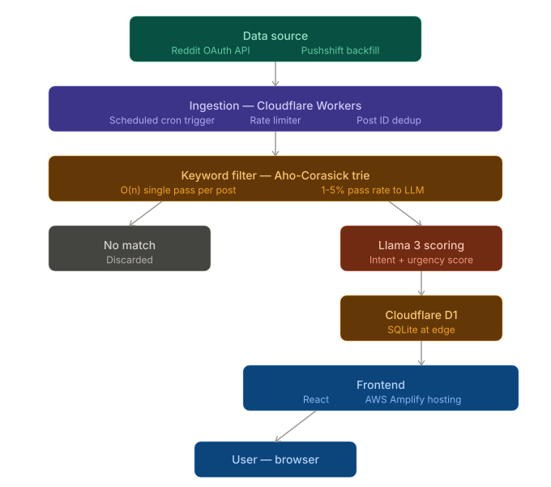
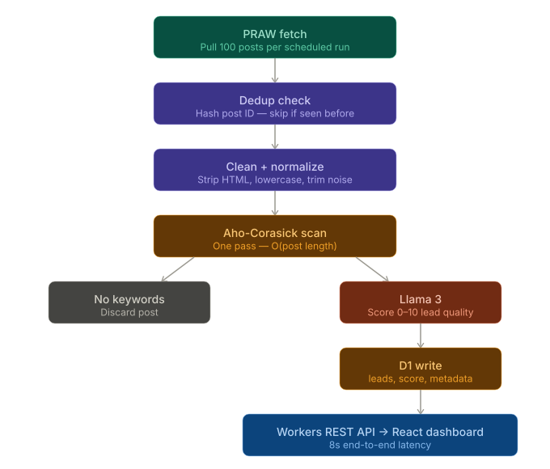

# digreddit - architecture & data flow

Reference diagrams for the digreddit pipeline. Both SVGs live alongside this file in the repo root.

## System architecture

End-to-end view of the components: Cloudflare Workers (ingestion + filter + scoring), D1 storage, and the React/Amplify dashboard.

## Data flow

Per-post path from Reddit ingestion through the Aho-Corasick keyword gate, Llama 3 scoring, and persistence to D1 before reaching the dashboard.

### Path summary

1. **Ingest** - scheduled Worker pulls posts from Reddit OAuth (live) and Pushshift (backfill).
2. **Dedup** - hashed post-ID lookup drops anything already seen (O(1) per post).
3. **Keyword gate** - Aho-Corasick trie scans each post in O(post_length); only 1–5% pass.
4. **Score** - Llama 3 rates intent/budget/urgency 0–10 on the survivors.
5. **Persist** - scored leads written to D1 at the edge.
6. **Serve** - REST API (`/leads`, `/stats`) feeds the React dashboard; reads stay under 50ms thanks to D1 edge co-location.
